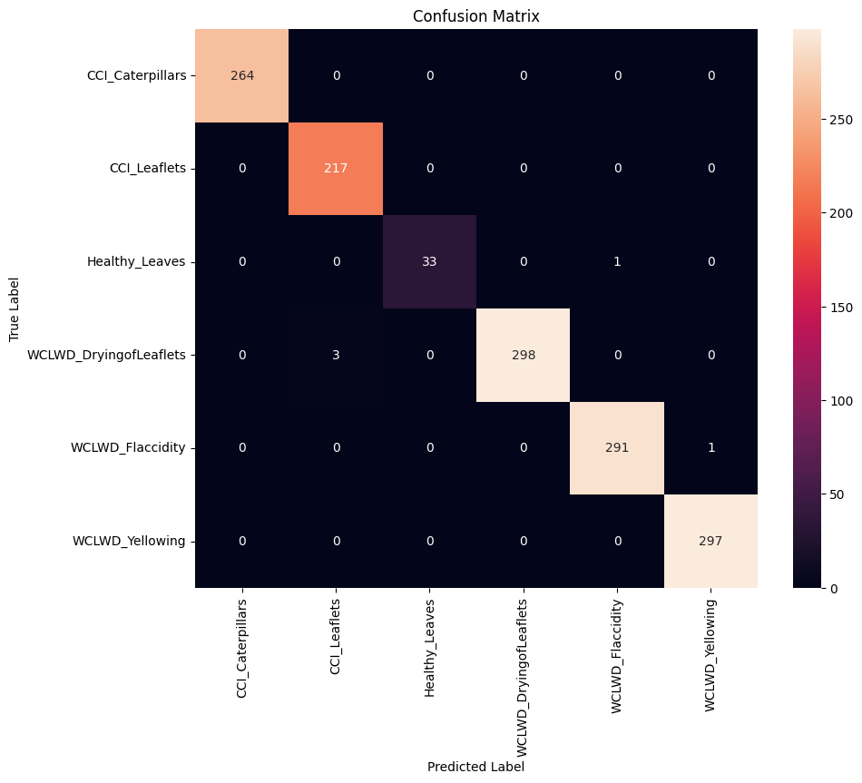

🌴 AI-Driven Coconut Cultivation Assistant

An intelligent system that uses computer vision and deep learning to identify and classify coconut leaf diseases, helping farmers make informed decisions about crop health and treatment.


## 📋 Table of Contents

- [Overview](#overview)
- [Features](#features)
- [Disease Categories](#disease-categories)
- [Hardware Requirements](#hardware-requirements)
- [Installation](#installation)
- [Dataset](#dataset)
- [Model Architecture](#model-architecture)
- [Training Results](#training-results)
- [Usage](#usage)
- [Project Structure](#project-structure)
- [Contributing](#contributing)
- [License](#license)

## 🎯 Overview

The AI-Driven Coconut Cultivation Assistant is a comprehensive solution that leverages Convolutional Neural Networks (CNN) to automatically detect and classify coconut leaf diseases from images. This system helps farmers and agricultural experts:

- **Identify diseases early** before they spread
- **Make data-driven decisions** about treatment
- **Monitor crop health** systematically
- **Reduce crop losses** through timely intervention

## ✨ Features

- 🔍 **High-Accuracy Disease Detection**: 99.64% overall accuracy
- 📊 **Six Disease Categories**: Comprehensive coverage of common coconut diseases
- 🖼️ **Image Preprocessing**: Automatic resizing and normalization
- 🔄 **Data Augmentation**: Enhanced training with rotation, flipping, and brightness adjustment
- ⚖️ **Class Balancing**: Handles imbalanced datasets effectively
- 📈 **Real-time Visualization**: Confusion matrix and performance metrics
- 🚀 **Easy Integration**: Simple API for prediction and evaluation

## 🦠 Disease Categories

The system can identify the following coconut leaf conditions:

| Disease Category | Description | Accuracy |
|------------------|-------------|----------|
| **CCI_Caterpillars** | Coconut Caterpillar Infestation | 100.00% |
| **CCI_Leaflets** | Coconut Caterpillar Infestation on Leaflets | 100.00% |
| **Healthy_Leaves** | Healthy coconut leaves | 97.06% |
| **WCLWD_DryingofLeaflets** | Wilt and Drying of Leaflets | 99.00% |
| **WCLWD_Flaccidity** | Wilt and Flaccidity | 99.66% |
| **WCLWD_Yellowing** | Wilt and Yellowing | 100.00% |

## 🔧 Hardware Requirements

### Circuit Diagram
The system utilizes a hardware setup as shown in the circuit diagram located in the `assets/` folder:


### Hardware Components
- **Camera Module**: For capturing coconut leaf images
- **Processing Unit**: Raspberry Pi or similar single-board computer
- **Storage**: SD card for model storage and data logging
- **Power Supply**: 5V power adapter for continuous operation
- **Display**: Optional LCD screen for real-time results

### System Requirements
- **CPU**: ARM Cortex-A72 or Intel Core i3 equivalent
- **RAM**: 4GB minimum, 8GB recommended
- **Storage**: 32GB minimum for model and data storage
- **Camera**: 8MP minimum resolution for clear image capture
- **OS**: Linux-based system (Raspberry Pi OS, Ubuntu)

## 🚀 Installation

### Prerequisites
- Python 3.8 or higher
- pip package manager
- Git

### Step 1: Clone the Repository
```bash
git clone https://github.com/yourusername/AI-Driven_Coconut_Cultivation_Assistant.git
cd AI-Driven_Coconut_Cultivation_Assistant
```

### Step 2: Install Dependencies
```bash
pip install -r models/image_classification.txt
```

### Step 3: Verify Installation
```bash
python -c "import tensorflow as tf; print('TensorFlow version:', tf.__version__)"
```

## 📊 Dataset

The model is trained on a comprehensive dataset of coconut leaf images:

- **Total Images**: 7,900+ images
- **Training Set**: 5,110 images (70%)
- **Validation Set**: 1,385 images (20%)
- **Test Set**: 1,405 images (10%)
- **Image Resolution**: 224x224 pixels
- **Format**: RGB images (JPG/PNG)

### Dataset Structure
```
Dataset/
├── Coconut_Diseases/
│   ├── train/
│   │   ├── CCI_Caterpillars/
│   │   ├── CCI_Leaflets/
│   │   ├── Healthy_Leaves/
│   │   ├── WCLWD_DryingofLeaflets/
│   │   ├── WCLWD_Flaccidity/
│   │   └── WCLWD_Yellowing/
│   ├── val/
│   └── test/
```

## 🧠 Model Architecture

The CNN model is designed for optimal feature extraction and disease classification:

### Architecture Overview
```
Input (224, 224, 3)
    ↓
Conv2D(32) → BatchNorm → ReLU → MaxPool2D
    ↓
Conv2D(64) → BatchNorm → ReLU → MaxPool2D
    ↓
Conv2D(128) → BatchNorm → ReLU → MaxPool2D
    ↓
Conv2D(256) → BatchNorm → ReLU → MaxPool2D
    ↓
Flatten
    ↓
Dense(512) → BatchNorm → ReLU → Dropout(0.5)
    ↓
Dense(6) → Softmax
```

### Key Features
- **4 Convolutional Blocks**: Progressive feature extraction
- **Batch Normalization**: Stabilizes training and improves convergence
- **Dropout**: Prevents overfitting (50% dropout rate)
- **Data Augmentation**: Rotation, flipping, brightness adjustment
- **Class Weighting**: Handles imbalanced datasets

## 📈 Training Results

### Performance Metrics
- **Overall Test Accuracy**: **99.64%**
- **Training Time**: ~50 epochs with early stopping
- **Model Size**: ~50MB (optimized for deployment)

### Per-Class Performance
| Class | Accuracy | Samples |
|-------|----------|---------|
| CCI_Caterpillars | 100.00% | High |
| CCI_Leaflets | 100.00% | High |
| Healthy_Leaves | 97.06% | Medium |
| WCLWD_DryingofLeaflets | 99.00% | High |
| WCLWD_Flaccidity | 99.66% | High |
| WCLWD_Yellowing | 100.00% | High |

### Confusion Matrix
The model shows excellent performance with minimal misclassifications:



## 💻 Usage

### Training the Model
```python
# Run the training notebook
jupyter notebook models/Image_Classification.ipynb
```

### Making Predictions
```python
from tensorflow.keras.models import load_model
from tensorflow.keras.preprocessing import image
import numpy as np

# Load the trained model
model = load_model('models/coconut_model_final.h5')

# Load and preprocess image
img_path = 'path/to/coconut_leaf.jpg'
img = image.load_img(img_path, target_size=(224, 224))
x = image.img_to_array(img) / 255.0
x = np.expand_dims(x, axis=0)

# Make prediction
prediction = model.predict(x)
class_names = ['CCI_Caterpillars', 'CCI_Leaflets', 'Healthy_Leaves', 
               'WCLWD_DryingofLeaflets', 'WCLWD_Flaccidity', 'WCLWD_Yellowing']
predicted_class = class_names[np.argmax(prediction)]
confidence = np.max(prediction) * 100

print(f"Predicted Disease: {predicted_class}")
print(f"Confidence: {confidence:.2f}%")
```

### Evaluating the Model
```python
# Run evaluation
python -c "from models.evaluate import evaluate_model; evaluate_model()"
```

## 📁 Project Structure

```
AI-Driven_Coconut_Cultivation_Assistant/
├── assets/
│   └── circuit_diagram.jpeg          # Hardware circuit diagram
├── Dataset/
│   ├── Coconut/                      # Raw dataset
│   └── Coconut_Diseases/             # Processed dataset
│       ├── train/                    # Training images
│       ├── val/                      # Validation images
│       └── test/                     # Test images
├── models/
│   ├── best_coconut_model.h5         # Best model checkpoint
│   ├── coconut_model_final.h5        # Final trained model
│   ├── Image_Classification.ipynb    # Training notebook
│   ├── Image_classification.md       # Model documentation
│   ├── image_classification.txt      # Dependencies
│   └── image.png                     # Confusion matrix
└── README.md                         # This file
```

## 🤝 Contributing

We welcome contributions! Please follow these steps:

1. Fork the repository
2. Create a feature branch (`git checkout -b feature/AmazingFeature`)
3. Commit your changes (`git commit -m 'Add some AmazingFeature'`)
4. Push to the branch (`git push origin feature/AmazingFeature`)
5. Open a Pull Request

### Development Guidelines
- Follow PEP 8 style guidelines
- Add tests for new features
- Update documentation as needed
- Ensure all tests pass before submitting

## 📄 License

This project is licensed under the MIT License - see the [LICENSE](LICENSE) file for details.

## 🙏 Acknowledgments

- Dataset contributors and agricultural experts
- TensorFlow and Keras communities
- Open source computer vision libraries
- Coconut cultivation research community

## 📞 Support

For support, email adityapratap.usingh@gmail.com or create an issue in the repository.

---

**Made with ❤️ for sustainable agriculture and food security**
