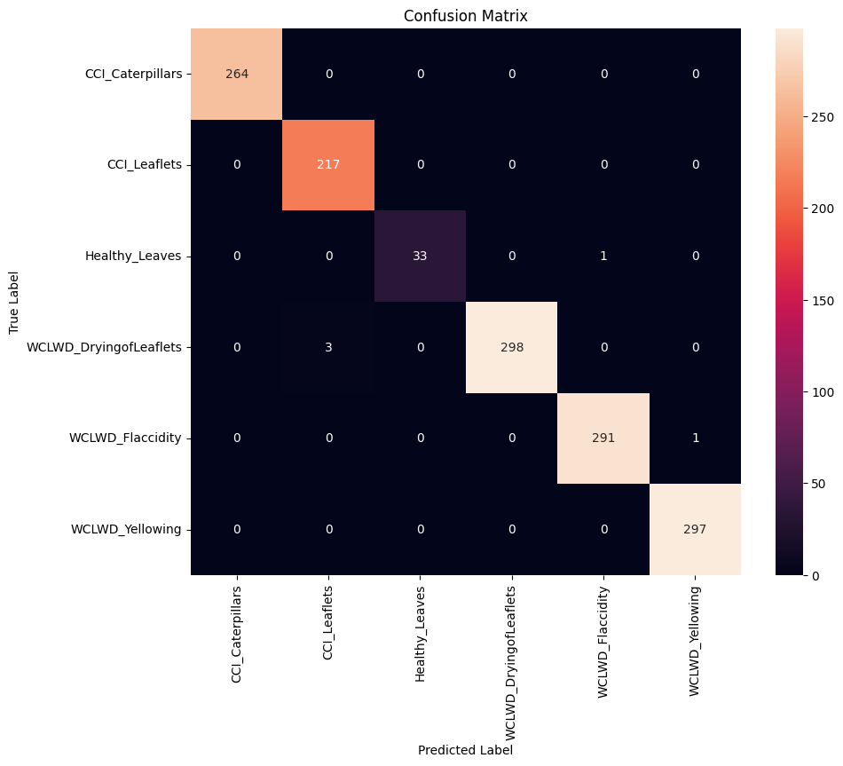

# Coconut Disease Classification using CNN

This project implements a Convolutional Neural Network (CNN) to classify coconut leaf diseases. The model is trained on images of coconut leaves, using data augmentation to improve generalization and handle limited dataset size.

---

## Table of Contents
- [Features](#features)
- [Data Preprocessing](#data-preprocessing)
- [Data Augmentation](#data-augmentation)
- [Dataset Split](#dataset-split)
- [Model Architecture](#model-architecture)
- [Training Configuration](#training-configuration)
- [Class Weighting](#class-weighting)
- [Training](#training)
- [Evaluation](#evaluation)
- [Results](#results)
- [Usage](#usage)
- [Contributing](#contributing)

---

## Features
- Classifies coconut leaf diseases into six categories.
- Handles class imbalance using class weighting.
- Uses data augmentation for better generalization.
- Provides per-class accuracy and confusion matrix visualization.

---

## Data Preprocessing
- Images are resized to `(224, 224, 3)` (RGB).
- Pixel values are rescaled by `1./255`.

---

## Data Augmentation
Applied during training to improve model robustness:
- Rotation: 45 degrees
- Width and height shifts: 0.3
- Shear range: 0.3
- Zoom range: 0.3
- Brightness range: `[0.8, 1.2]`
- Horizontal and vertical flips
- Fill mode: nearest

---

## Dataset Split
- **Train set:** 70% (with augmentation)
- **Validation set:** 20% (rescaled only)
- **Test set:** 10% (rescaled only)

The `prepare_dataset` function (assumed to be part of the codebase) organizes images into `train`, `val`, and `test` subdirectories.

---

## Model Architecture

The CNN is designed to extract hierarchical features from images, enabling it to distinguish subtle differences between coconut leaf disease types.  

### Input Layer
- **Shape:** `(224, 224, 3)`
- **Purpose:** Accepts RGB images resized to a consistent dimension.

### Convolutional Blocks
Feature extraction is done using four convolutional blocks. Each block typically contains:
1. **Conv2D layer**: Extracts spatial features like edges, textures, and patterns.
2. **ReLU activation**: Introduces non-linearity to capture complex patterns.
3. **BatchNormalization**: Normalizes activations to speed up training and stabilize learning.
4. **MaxPooling2D**: Reduces spatial dimensions, keeping important features while lowering computation.

**Block Details:**
- **Block 1:** Conv2D(32, 3x3) → ReLU → BatchNorm → MaxPool(2x2)  
  - Captures low-level features (edges, simple textures)
- **Block 2:** Conv2D(64, 3x3) → ReLU → BatchNorm → MaxPool(2x2)  
  - Captures slightly more complex patterns (leaf structures)
- **Block 3:** Conv2D(128, 3x3) → ReLU → BatchNorm → MaxPool(2x2)  
  - Captures disease-specific features and irregularities
- **Block 4:** Conv2D(256, 3x3) → ReLU → BatchNorm → MaxPool(2x2)  
  - Captures high-level semantic features distinguishing disease types

### Flatten Layer
- Converts 2D feature maps to a 1D vector to feed into fully connected layers.

### Dense Layers
- **Dense(512) → ReLU → BatchNorm → Dropout(0.5)**
  - Learns complex combinations of features
  - Dropout prevents overfitting
- **Dense(6) → Softmax**
  - Outputs probability distribution over 6 disease classes

## Training Configuration
- **Optimizer:** Adam, initial LR = 0.0001, reduced to 0.00001 for fine-tuning
- **Loss Function:** Categorical Cross-Entropy
- **Metrics:** Accuracy

**Callbacks:**
- EarlyStopping (monitor validation loss, patience=10, restore best weights)
- ModelCheckpoint (save best model to `best_coconut_model.h5`)
- ReduceLROnPlateau (factor=0.2, min LR=0.00001)

---

## Class Weighting
- Computed using `sklearn.utils.class_weight.compute_class_weight` with `balanced` strategy
- Gives higher weight to minority classes (e.g., Healthy_Leaves) to handle imbalance

---

## Training
- Use `train_model` function to load and augment training data
- Trains up to 50 epochs with callbacks
- Saves final model as `coconut_model_final.h5`

---

## Evaluation
- Use `evaluate_model` function to assess performance on the test set
- Provides:
  - Overall test accuracy
  - Per-class accuracy
  - Confusion matrix heatmap

---

## Results
**Per-class Accuracy:**
- CCI_Caterpillars: 100.00%  
- CCI_Leaflets: 100.00%  
- Healthy_Leaves: 97.06%  
- WCLWD_DryingofLeaflets: 99.00%  
- WCLWD_Flaccidity: 99.66%  
- WCLWD_Yellowing: 100.00%  

**Overall Test Accuracy:** 99.64%  

**Confusion Matrix**

The confusion matrix below shows the performance of the CNN on the test set. The diagonal values represent correctly classified samples, while off-diagonal values indicate misclassifications.

